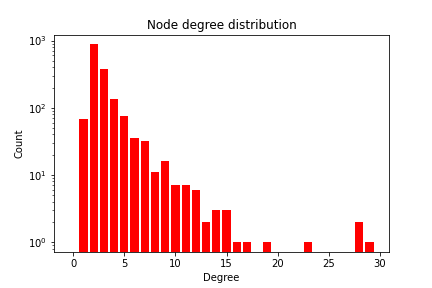

Les CFF sont reconnus pour leur excellence en matière de transport ferroviaire en comparaison avec les pays voisins. D'un point de vue purement topologique, le réseau ferré Suisse est maillé et décentralisé, contrairement au réseau Français en étoile, polarisé autour de Paris. 

Cependant, des disparités en matière d’offre ferroviaire peuvent apparaître dans certaines régions suisses. En effet, les niveaux d’investissement en infrastructure sur le réseau ferroviaire n’ont pas profité équitablement aux différents cantons suisses. Ces inégalités peuvent être perçues en observant les projets de développement entrepris par les CFF. Par exemple, la plupart des projets de [Rail 2000](https://en.wikipedia.org/wiki/Rail_2000) proposent principalement des améliorations en Suisse alémanique. Ce n’est que récemment que l’importance a été donnée à la Suisse romande à travers les projets comme [Léman 2030](https://company.sbb.ch/fr/entreprise/projets/suisse-romande-et-valais/leman-2030.html) et Léman Express. 
  
**La typologie du réseau ferroviaire helvétique traduit-elle des particularités territoriales suisses ?**
  
Il s’agira dans ce travail d'analyser la topologie du réseau ferroviaire suisse d’un point de vue (purement) mathématique. Dans un premier temps, nous étudierons les données [GTFS](https://developers.google.com/transit/gtfs/?hl=fr) (*General Transit Feed Specification*) mises à disposition par les CFF afin de construire un graphe représentant le réseau ferré. Ensuite, à l’aide d’outils d’analyse de graphes, nous étudierons les propriétés de ce dernier pour détecter des particularités territoriales et créer une typologie. 

Une telle modélisation nous permettra donc d'étudier les différentes propriétés du réseau comme la centralité des gares ou encore le poids de certains tronçons au sein du système ferroviaire. Des méthodes comme le clustering ou encore la détection d’éléments connectés pourraient nous aider à identifier des zones mal desservies. 

Nous profiterons également de porter un regard critique sur la représentation des données de transport et ses limites ainsi que sur la comparabilité et interprétabilité des résultats de notre étude. Pour cela, nous comparerons d’abord les différents moyens de représenter des données de transport, pour tenter de justifier l’utilisation du standard GTFS. Nous verrons ensuite dans quelles mesures des études similaires peuvent être comparées.

## Travaux connexes

Beaucoup de chercheurs se sont aussi intéressés à l'analyse des réseaux formés par les systèmes de transport public, et ce à différentes échelles. Il est donc intéressant de citer quelques travaux similaires au notre, à des fins de comparaison. Cela s'averera utile lors du choix des analyses à effectuer.

- Mohmand & Wang (2014) étudient les propriétés structuelles du réseau ferroviaire pakistanais,
- Soh et al. (2010) apportent une analyse de réseau complexe pondéré des itinéraires de voyage sur les systèmes de transport par rail et par bus de Singapour,
- De Regt et al. (2019) étudient les caractéristiques topologiques et spatiales des réseaux de transport public au Royaume-Uni, 
- Erath et al. (2009) étudient le développement du réseau routier et ferroviaire suisse au cours des années 1950-2020.

## La construction du graphe

<form name="change">
<SELECT NAME="options" ONCHANGE="document.getElementById('map').src = this.options[this.selectedIndex].value">
<option value="network.html">Base graph</option>
<option value="network_betweenness.html">Betweenness centrality</option>
<option value="network_communities.html">Community detection</option> 
</SELECT>
</form>

  

<iframe src="network.html" id="map" height="800px" width="100%" style="border:none;"></iframe>

## L'analyse du réseau

<!-- #### Détection de communautés
Nous commençons par parler de la détection de communautés. L'algorihtme choisi pour cela était `Modularity Community Detection`. Cet algorithme cherche à maximiser la modularité du graph, c'est à dire à le séparer en des sous-graphs qui seront très connexes mais pas très interconnectés. Cette approche nous a laissé avec 50 sous graphes différents avec les 10 les plus grands couvrant la majorité du territoire suisse. Cependant nous avons l'obligation de poser la question sur le vrai sens de ces classifications mathématiques, et il s'avère que des lacunes se présentent tout de suite.

On observe que les frontières inter-communautaires ne sont pas très pertinentes. Des gares qui appartiennent à la même ville peuvent se trouver dans deux communautés différentes du point de vue de l'analyse. Par exemple on a la gare de Lausanne qui dans une communauté séparé de Prilly-Malley, de même pour Basel SBB et Basel-Dreispitz. Il nous semble donc que le choix de cette méthode d'analyse n'était pas approprié à la nature du réseau de chemin de fer suisse. -->

<!-- ### Comparaison avec les résultats d'un autre étude -->

Une fois le graphe représentant le réseau ferroviaire construit, nous pouvons passer à son analyse. Nous avons trouvé pertinant de travailler avec des statistiques identiques à celles utilisées dans les études mentionnées plus haut. En s'aidant des guides de Ducruet (2010), nous avons étudié les caractéristiques locales et globales de notre graphe.  

Les résultats sont présentés dans le tableau ci-dessous. Nous avons aussi rapporté ceux des travaux connexes à des fins de comparaison. Remarquez la distinction entre Réseau Ferré (RF) et Transport Public (TP).

| Propriété | Traduction | RF Suisse | RF Pakistanais | TP Singapourien | RF Britanique | RF Chinois |
|-|-|:-:|:-:|:-:|:-:|:-:|
| Nombre de noeuds | Number of nodes | 1663 | 628 | 93 | 2575 | 1192 |
| Nombre de liens | Number of edges | 2514 | 6078 | 3843 | 4450 | 67594 |
| Diamètre | Diameter | 36 | 5 | 2 | 48 | - |
| Chemin le plus court moy. | Shortest path (avg.) | 10.319 | 3.15 | 1.101 | 11.82 | 2.21 |
| Efficacité | Efficiency | 0.1068 | 0.25 | - | - | - |
| Centralité de proximité moy.| Closeness centrality (avg.) | 0.0917 | 0.2 | - | - | 0.46 |
| Centralité d’intermédiarité moy.| Betweenness centrality (avg.) | 0.0074 | 0.01 | - | - | 0.001 |
| Degré moyen | Average degree | 3.0271 | 19.36 | 82.6452 | 3.46 | 113 |
| Plage de degrés | Degree range | (1, 29) | (2, 69) | (35,92) | (-, 31) | (1, 673) |
| Transitivité moyenne | Average clustering | 0.2602 | 0.97 | 0.9341 | 0.309 | 0.68 |
| Assortativité | Assortativity | 0.2815 | 0.34 | −0.0875 | 0.24 | - |

<!-- Nous commençons par explorer la distribution des degrés des noeuds -->

<!--  -->

En comparaison au nombre de noeuds, le nombre de liens semble insuffisant. De plus, les noeuds ont un degré moyen de 3: c'est à dire qu'il y a plus de gares très peu connectés qu'il n'y a de grandes gares connectées. La transitivité moyenne de 0.26 est caractéristique d'un réseau décentralisé, sans beaucoup de gares centrales. Cela justifie aussi la centralité de proximité moyenne très basse.

### Centralité des noeuds

| Gare | Centralité d’intermédiarité |  |  |  | Gare | Centralité de proximité |
|-|:-:|-|-|-|-|:-:|
| Olten | 0.4795 |  |  |  | Olten | 0.1629 |
| Brig | 0.3930 |  |  |  | Zürich HB | 0.1621 |
| Zürich HB | 0.3384 |  |  |  | Bern | 0.1615 |
| Zollikofen | 0.2799 |  |  |  | Basel SBB | 0.1588 |
| Basel SBB | 0.2587 |  |  |  | Münsingen | 0.1511 |
| Münsingen | 0.2486 |  |  |  | Brig | 0.1509 |
| Bellinzona | 0.2277 |  |  |  | Aarau | 0.1505 |
| Nyon | 0.1736 |  |  |  | Oensingen | 0.1489 |
| Sion | 0.1692 |  |  |  | Brugg AG | 0.1489 |
| Lausanne | 0.1669 |  |  |  | Fribourg/Freiburg | 0.1479 |

<!-- Tout ceci dit, nous sommes clairement dans une situation où nous avons fait des choix, qui n'étaient pas clarifiés dans l'étude de Mohamad et Wang, et qui ne sont apparemment pas les mêmes chois qu'eux. Ce qui parle d'un manque de transparence, et donc un manque de réplicabilité dans l'étude susmentionnée -->

## À propos du format des données 

Il existe plusieurs façons de représenter les données de transport, chacune étant adéquate à telle ou telle utilisation. Il est donc légitime de se demander si le format GTFS que nous utilisons pour construire le graphe du réseau ferré suisse répond bien à nos demandes, et si d’autres alternatives auraient pu être utilisées. Parmi les autres formats disponibles, nous pouvons citer NeTEx (*Network Timetable Exchange*), le *Public Transport Version 2* (ptv2) d’OpenStreetMap, et le graphe de connaissances WikiData. 

Les trois formats mentionnés ci-dessus permettent la représentation d’informations et de relations complexes, comme la différenciation des quais et des entrées au sein d’une gare. Il est donc important de se limiter aux fonctionnalités dont nous avons besoin pour cette étude, notamment la représentation des gares, celle de la politique de desserte des différentes lignes, et le lien entre les deux. 

### La représentation des lignes

Les lignes de transport public opèrent le long d’itinéraires prédéfinis, s'arrêtant à plusieurs arrêts pour la montée et la descente de passagers. Prenons par exemple la ligne IR 90 reliant Brig à Genève-Aéroport qui dessert systématiquement les villes principales contrairement aux villes secondaires, desservies ou non selon les différents services.

| Format | Commentaire | Exemple |
|-|-|-|
| GTFS | Fait la distinction entre une ligne et les itinéraires qui opèrent sur cette dernière. On peut dire que ce format offre une vision temporelle des lignes, car il permet aussi de spécifier les horaires (jours, et heures exactes) de chaque itinéraire.  | L’itinéraire s'arrêtant à Genève, Nyon, Morges puis Lausanne est différent de celui qui lie directement Lausanne à Genève. Ces deux différents itinéraires sont opérés sur la même ligne IR 90. |
| ptv2, OpenStreetMap | Ne fait pas la distinction entre itinéraires, et représente une ligne d’un point de vue géographique. La modélisation des lignes sur OSM est loin d’être homogène. La couverture des lignes n’est pas exhaustive, malgré tous les efforts mis en place pour instaurer un format commun. | La [ligne IR 90](https://www.openstreetmap.org/relation/7796313) sur OpenStreetMap. En choisissant une direction, il est possible de visualiser les arrêts de la ligne et de les obtenir grâce à l’attribut “membres”.  |
| WikiData | Ne permet pas de représenter des lignes commerciales spécifiques. Le format contient des informations plus génériques comme “ligne du Simplon” plutôt que "IR 90". Très peu de lignes  commerciales de transport y sont modélisées.  | [Ligne du Simplon](https://www.wikidata.org/wiki/Q667559) sur WikiData. |
| NeTEx | Similaire au format GTFS. |  |

### La représentation des gares

La représentation des gares est très similaire dans les quatre formats. Ils emploient tous la notion de points d'arrêt. Nous nous intéressons à la localisation des gares et au lien entre ces dernières et les lignes. 

| Format | Localisation | Relation arrêts-lignes | Exemple |
|-|-|-|-|
| GTFS | Obligatoire | Le lien entre une ligne et ses arrêts est indirect et est lié aux horaires de la ligne et de ses services |  |
| ptv2, OpenStreetMap | Obligatoire | Le lien entre une ligne et ses arrêts est explicitement indiqué. | La [gare de Lausanne](https://www.openstreetmap.org/node/1800313662) sur OpenStreetMap |
| WikiData | Obligatoire | Le lien entre un arrêt et une ligne est parfois indiqué.  | La [gare de Lausanne](https://www.wikidata.org/wiki/Q669678) sur WikiData |
| NeTEx | Optionnelle  | Permet d’obtenir les arrêts d’une ligne de manière plus directe. | |

### Disponibilité des formats

Il est possible de télécharger directement les données au format GTFS ou NeTEx : ces formats sont indépendants de toute plateforme. Dans le cas de WikiData et d’OpenStreetMap, il est nécessaire de faire recours à du web scraping pour récupérer les informations nécessaires.

En Suisse, CFF Infrastructure est responsable de la conduite des tâches systémiques relatives aux données d’informations voyageurs ou SKI (*Systemaufgaben der Kundeninformation*). Le Secrétariat des tâches SKI valide officiellement le format HRDF qu’il retranscrit automatiquement au format GTFS. Le support pour le format NeTEx est encore en phase alpha de test. 

Les plateformes OpenStreetMap et WikiData sont accessibles et modifiables par le grand public. Leur utilisation à l'échelle Suisse n’est pas adéquate vu qu’il existe une alternative officielle. Cependant, dans le cadre d’un projet à échelle plus large (européenne ou mondiale), il serait envisageable de les utiliser comme source unique de données, au lieu d'agréger les sources de plusieurs pays. 

## Interprétabilité de l’étude

À partir du graphe construit, nous avons eu l’occasion de réaliser plusieurs analyses sur l’objet mathématique obtenu. Pour choisir les mesures adéquates, nous nous sommes inspirés d’études similaires effectuées dans d’autres pays ou villes.  

Comme Boyd et Crawford le mentionnent dans leur *deuxième* provocation pour les Big Data, l’impératif  d’objectivité et d'exactitude est trompeur. Lors de la construction initiale du graphe, nous avons dû faire des choix quant au nettoyage et au traitement des données. Dès lors, notre analyse devient subjective et nous sommes limités en matière de comparaison et d’interprétation. 

<blockquote>
As a large mass of raw information, Big Data is not self-explanatory. And yet the specific methodologies for interpreting the data are open to all sorts of philosophical debate. Can the data represent an “objective truth” or is any interpretation necessarily biased by some subjective filter or the way that data is “cleaned?”

‒ David Bollier, The Promise and Peril of Big Data

</blockquote>

En effet, pour pouvoir comparer des analyses, il faut que ces dernières soient effectuées dans des conditions similaires. Rien ne garantit que notre graphe a été construit de la même manière que celui d’une étude connexe. De plus, chaque ville ou pays connaît une situation unique, et une géographie propre à son territoire. Il faut donc tenir compte de cela lors de la comparaison des résultats d’un pays à l’autre. Alors qu'il est vrai que nous abstrayons le réseau ferroviaire sous forme de graphe, le contexte reste essentiel : cela résonne avec la *quatrième* provocation de Boyd et Crawford. 

Enfin, notre graphe croise deux sources d’information : les données GTFS d’une part, et les statistiques sur le nombre de personnes montant et descendant des trains par gare d’autre part. Le nombre de gares dans la première est largement supérieur au nombre de gares de la deuxième. Nous avons, ici aussi, dû faire un choix qui introduit un biais devant être pris en compte lors de l’interprétation des résultats. Il est pertinent de faire le lien avec la troisième *provocation* de Boyd et Crawford, stipulant que l’abondance des données ne rime pas avec qualité. 

<blockquote>
“Every one of those sources is error-prone, and there are assumptions that you can safely match up two pieces together. So I think we are just magnifying that problem [when we combine multiple data sets]. There are a lot of things we can do to correct such problems, but all of them are hypothesis-driven.”

 ‒ Jesper Andersen

</blockquote>

